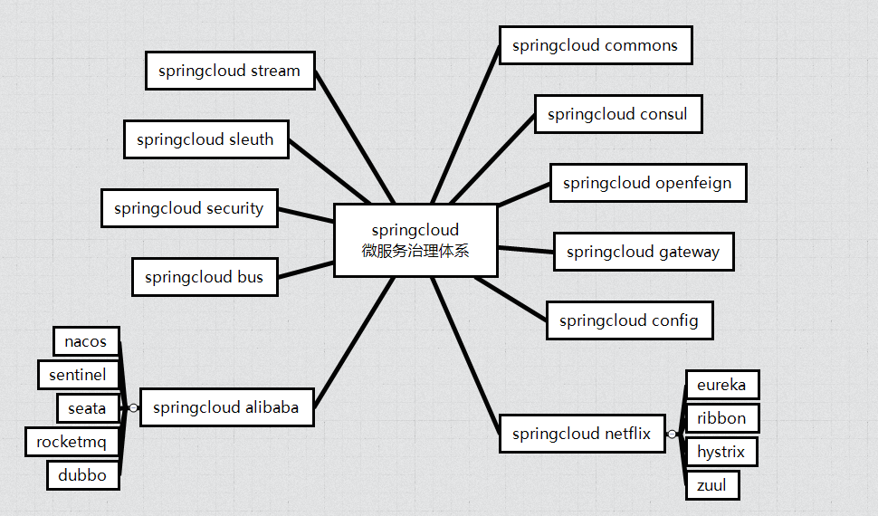

## 深入分析SpringCloud体系

#### 概述

#### 组件拓扑

#### roadmap

组件实战->核心功能点枚举->源码->源码功能点流程图

#### 组件选型

- 注册中心 **[nacos](https://nacos.io/zh-cn/docs/architecture.html)**
- 客户端负载均衡 **ribbon**(**feign**)
- 服务流量控制 **sentinel**
- 微服务网关 **gateway**
- [配置中心 **nacos**](https://www.cnblogs.com/xing1/articles/15757323.html)
- 分布式事务 **seata**

#### Domain-Driven-Design 系列

#### 参考资源

- [SpringCloud系列教程](https://blog.csdn.net/forezp/category_6830968.html?spm=1001.2014.3001.5482)
- [阿里云maven仓搜素](https://developer.aliyun.com/mvn/search)
- [SpringCloud Alibaba](https://github.com/alibaba/spring-cloud-alibaba/blob/2021.x/README-zh.md)
- [SpringCloud版本说明](https://github.com/alibaba/spring-cloud-alibaba/wiki/%E7%89%88%E6%9C%AC%E8%AF%B4%E6%98%8E)
- [SpringCloud中文网](https://www.springcloud.cc/)